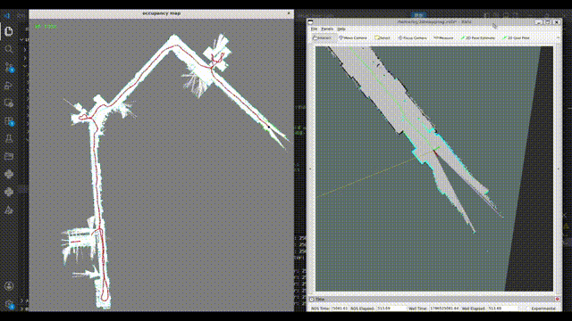
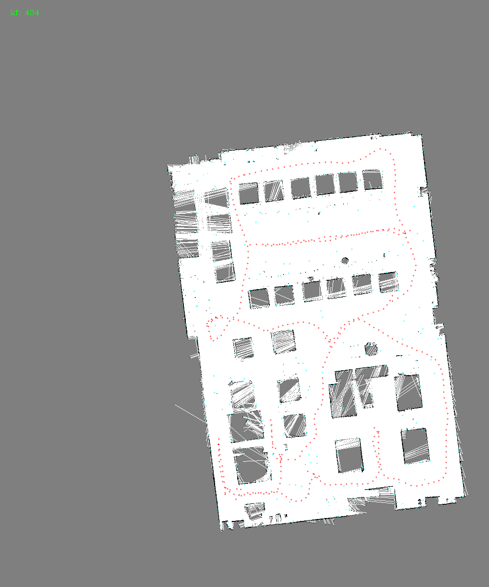

# NdtLIO

基于**增量式 NDT** 的 2D 激光惯性里程计 / SLAM 系统（ROS2）。
支持三种工作模式：纯激光里程计（LO）、ESKF 松耦合 LIO、IESKF 紧耦合 LIO，并提供建图 / 定位两种运行形态。

---

## 演示与效果

LIO 建图 / 运行过程演示（动图）：



建图完成后的全局地图效果：



---

## 特性

- **增量式 NDT 配准**：哈希体素地图（`std::list` + `unordered_map` LRU 缓存），支持 center / 4 邻域 / 8 邻域三种最近邻策略，Gauss-Newton 求解，并行化残差与雅可比计算
- **三种融合模式**（`with_imu` 配置）：
  - `0` — 纯激光里程计 LO
  - `1` — ESKF 松耦合 LIO（雷达位姿作为观测）
  - `2` — IESKF 紧耦合 LIO（NDT 残差 + 雅可比直接作为自定义观测进入迭代滤波）
- **点云去畸变**：基于 IMU 位姿缓存的 SE2 插值 + 雷达/IMU 外参（`T_IL`）补偿，已适配 N10 雷达点序反转
- **增量占据栅格地图**：Bresenham 直线填充，实时发布 `nav_msgs/OccupancyGrid`，可与 `nav2_map_server` 配合保存地图
- **关键帧管理**：按位移/角度阈值选取关键帧，输出轨迹 `nav_msgs/Path`
- **双模式**：建图模式（`base -> map`）、定位模式（`base -> odom`，`map -> odom` 由初始位姿提供）
- 支持轮速计观测（订阅 `origincar_msg/msg/Data`）

## 参考项目

本项目核心实现参考高翔《自动驾驶与机器人中的 SLAM 技术》配套开源代码 [slam_in_autonomous_driving](https://github.com/gaoxiang12/slam_in_autonomous_driving) 中 `src` 的 **ch7** 与 **ch8**：

- **ch7** — 3D NDT + 松耦合 ESKF（雷达位姿作为滤波观测）
- **ch8** — 3D NDT + 紧耦合 IESKF（NDT 残差与雅可比进入迭代滤波）

原参考代码为 **3D（SE3）实现**，本项目将其**改写为 2D（SE2）版本**（`NdtInc2d` 增量式 2D NDT、2D ESKF/IESKF、`T_IL` 外参补偿等），并针对 origincar 平台做了适配与扩展：N10 雷达运动畸变去除、轮速计观测、增量占据栅格地图、建图/定位双模式等。

## 系统要求

- **ROS2**（Humble 及以上，ament_cmake）
- **依赖库**：Eigen3、Sophus（内置 `3rdparty/sophus`）、glog、OpenCV、TBB、yaml-cpp
- **自定义消息包**：`origincar_msg`（提供轮速计消息 `origincar_msg/msg/Data`，需与 `NdtLIO` 同工作区）

## 构建

```bash
cd ~/origincar_ws
colcon build --packages-select origincar_msg   # 先构建自定义消息包
colcon build --packages-select NdtLIO
source install/setup.bash
```

## 运行

### 建图

```bash
ros2 run NdtLIO test_ros2_lio --ros-args \
  -p config_file:=$(pwd)/src/Ndtlio/config/mapping.yaml
```

### 定位

```bash
ros2 run NdtLIO test_ros2_lio --ros-args \
  -p config_file:=$(pwd)/src/Ndtlio/config/localization.yaml
```

定位模式启动后，需在 **RViz 中用 "2D Pose Estimate"** 发布一次初始位姿（对应话题 `/initialpose`），系统才开始输出 `base -> odom`。

> 定位模式**不包含重定位功能**：按比赛要求，建图与定位在同一场景、同一起点进行，重定位意义不大，故仅以初始位姿作为 `map -> odom` 的一次性输入，之后靠里程计递推。若中途丢失位姿，需重新用 "2D Pose Estimate" 给出初始位姿（或通过 `/sign4return` 发送 `-2` 重置系统后再给定）。

### IMU 初始化工具（标定噪声 / 零偏 / 静态投影矩阵）

```bash
ros2 run NdtLIO process_imu --ros-args \
  -p config_file:=$(pwd)/src/Ndtlio/config/process_imu.yaml
```

### 保存地图（建图模式）

```bash
ros2 run nav2_map_server map_saver_cli -t map -f origincar_map
```

节点发布的 `/map` 使用 `transient_local + reliable` QoS，与 `map_saver_cli` 默认 QoS 兼容。

> 说明：`launch/ndt_lio_node.launch.py` 仅启动 `test_ros2_lio` 并重映射两个输出话题（`/scan_point_cloud -> /ndt_lio/scan_point_cloud`、`/ndt_odom -> /ndt_lio/ndt_odom`），**未设置 `config_file` 参数**，直接 launch 会使用代码中的默认路径，建议用 `ros2 run ... -p config_file:=` 显式指定。

## 话题与 TF

### 订阅

| 话题 | 类型 | 说明 |
| --- | --- | --- |
| `/scan` | `sensor_msgs/LaserScan` | 单线激光雷达（话题名可在配置中修改） |
| `/imu` | `sensor_msgs/Imu` | IMU（`with_imu != 0` 时需要） |
| `/robotvel` | `origincar_msg/Data` | 轮速计速度（`with_imu != 0` 时需要） |
| `/initialpose` | `geometry_msgs/PoseWithCovarianceStamped` | 定位模式初始位姿（RViz 2D Pose Estimate） |
| `/sign4return` | `std_msgs/Int32` | 收到 `-2` 时重置整个 LIO 系统 |

### 发布

| 话题 | 类型 | 说明 |
| --- | --- | --- |
| `/trajectory` | `nav_msgs/Path` | 关键帧轨迹 |
| `/scan_point_cloud` | `sensor_msgs/PointCloud2` | 去畸变后的 2D 点云（x, y, z=0） |
| `/ndt_odom` | `nav_msgs/Odometry` | 定位模式下 10Hz 发布的里程计（ESKF 名义状态） |
| `/map` | `nav_msgs/OccupancyGrid` | 建图模式下 10Hz 发布的占据栅格地图 |

### TF

| 变换 | 说明 |
| --- | --- |
| `map -> base`（建图）/ `odom -> base`（定位） | 实时发布，动态 TF |
| `map -> odom`（定位） | 静态 TF，取自 `/initialpose`，2s 刷新一次 |
| `base -> laser`、`base -> imu` | 静态 TF（当前恒为单位变换，真实外参需自行调整） |

## 配置说明

配置文件为 YAML，位于 `config/`：

- `mapping.yaml` — 建图模式
- `localization.yaml` — 定位模式
- `process_imu.yaml` — IMU 初始化工具

### `main`

| 字段 | 说明 |
| --- | --- |
| `laser_topic` / `imu_topic` / `odom_topic` | 话题名 |
| `localization_mode` | `true` 定位模式 / `false` 建图模式 |
| `with_imu` | `0` LO ｜ `1` ESKF LIO ｜ `2` IESKF LIO |
| `delay_time` | 延时（ms） |

### `frontend`

| 字段 | 说明 |
| --- | --- |
| `kf_distance` / `kf_angle_deg` | 关键帧位移 / 角度阈值 |
| `kf_add_scan_in_occu` | 每 N 个关键帧放入一次占据栅格地图 |
| `max_distance` / `angle_boarder` | 点云距离 / 角度裁剪 |
| `imu_states_buffer_size` | 去畸变用的 IMU 位姿缓存长度 |
| `T_IL` | 雷达 → IMU 外参 `[x, y, theta]`（m, m, rad），须按实际安装标定 |

### `ndt`

| 字段 | 说明 |
| --- | --- |
| `max_iter` | 配准最大迭代次数 |
| `voxel_size` | 体素大小（m），过小在旋转时易产生偏移 |
| `min_effective_pts` / `min_pts_in_voxel` / `max_pts_in_voxel` | 有效点 / 体素内点数阈值 |
| `eps` | 终止迭代条件（负值则取 `voxel_size * 1%`） |
| `res_outlier_th` | 基于马氏距离的卡方检验阈值（95% 置信度 ≈ 5.991） |
| `capacity` | 体素缓存上限（LRU） |
| `normalizing_factor` / `init_info` | 正则化因子 / 初始信息矩阵 |
| `nearby_type` | `0` center ｜ `1` 4 邻域 ｜ `2` 8 邻域 |

### `occupancy_map`

| 字段 | 说明 |
| --- | --- |
| `closest_th` / `endpoint_close_th` | 近距离 / 末端点障碍物阈值 |
| `resolution` | 1m 对应像素数 |
| `image_size` | 占据栅格图像尺寸（像素） |

### `imu`

| 字段 | 说明 |
| --- | --- |
| `imu_dt` | IMU 周期（100Hz = 0.01s），用于时间戳检查 |
| `bax` / `bay` / `bg` | 初始加速度零偏（x/y）与陀螺零偏（z） |
| `gyro_var` / `acce_var` | 陀螺 / 加计测量噪声（负值则按静止初始化自动计算） |
| `bias_gyro_var` / `bias_acce_var` | 零偏游走噪声（负值自动取测量噪声的 1%） |
| `odom_var` | 轮速计噪声（正值则在滤波中加入轮速观测） |
| `update_bias_gyro` / `update_bias_acce` | 迭代过程中是否更新零偏 |
| `eskf` | `lidar_pos_noise` / `lidar_ang_noise`：雷达位姿观测噪声 |
| `ieskf` | `num_iterations` 迭代次数、`eps` 终止条件、`info_ratio` 每点信息因子 |

## 目录结构

```
Ndtlio/
├── CMakeLists.txt            # 顶层构建（静态库 NDT_LIO + 节点）
├── package.xml
├── 3rdparty/sophus/          # 内置 Sophus 头文件库（SE2/SO2）
├── include/                  # 核心算法头文件
│   ├── incrementalNDTLO.h    # 顶层封装：配置加载、IMU 初始化、算法组装
│   ├── frontend.h            # 前端：去畸变、关键帧、NDT 匹配调度
│   ├── ndt_inc.h             # 增量式 2D NDT
│   ├── map.h                 # 地图管理（NDT 体素图 + 占据栅格）
│   ├── occupancy_map.h       # Bresenham 占据栅格地图
│   ├── eskf.h                # 误差状态卡尔曼滤波（8 维状态）
│   ├── ieskf.h               # 迭代误差状态卡尔曼滤波
│   └── frame.h               # 帧结构
├── common/                   # 通用：Eigen 类型、IMU/Odom、静止初始化、数学工具
├── src/                      # 算法实现（编译为静态库 NDT_LIO）
├── ros2node/ndt_lio_node.*   # ROS2 节点：话题/TF/地图发布
├── config/                   # YAML 配置
├── launch/                   # launch 文件
├── doc/                      # 演示资源（demo1.gif 运行演示动图）
├── map/                      # 建图结果（global_map.png 全局地图效果图）
├── process_imu.cpp           # IMU 初始化工具节点
└── test_ros2_lio.cpp         # 主节点入口
```

## 架构与数据流

```
LaserScan ──┐
IMU ────────┼──> Frontend ──> 去畸变点云 ──> NDT 配准 ──> 关键帧 ──> Map
Odom ───────┘      │                │                        │
                   └── ESKF / IESKF 预测+观测更新            └── 占据栅格 + /trajectory
```

- **`IncrementalNDTLO`**：从 YAML 加载全部参数，按 `with_imu` 组装 `Frontend` + `Map` + `ESKF`/`IESKF`；负责 IMU 初始化（静止初始化器估计零偏与噪声）。
- **`Frontend::undistortAndGeneratePoints`**：有 IMU 时，对每个点用缓存的 IMU 位姿做 SE2 插值，再经外参 `T_IL` 补偿到扫描末端时刻；无 IMU（LO）时直接使用原始点。
- **`NdtInc2d`**：增量体素地图（LRU 缓存 + 哈希索引），`alignNdt` 用 Gauss-Newton 配准；`computeResidualAndJacobians` 输出 `H^T V^-1 H` / `H^T V^-1 r` 供 IESKF 紧耦合观测。
- **`OccupancyMap`**：将关键帧点云经 Bresenham 直线填充为 `CV_8U` 占据图（127 = 未知），发布时映射为 `-1` 未知 / `100` 占用 / `0` 空闲。
- **状态向量**（ESKF/IESKF 均为 8 维）：`[px, py, vx, vy, theta, bg, ba_x, ba_y]`。

## 注意事项

- **雷达点序**：代码按 N10 驱动约定处理——`ranges[0]` 是最后打出的点，对应最晚时刻；去畸变时做了时间顺序反转。`angle_inc` 与 `time_inc` 目前在 `frontend.cpp` 中为硬编码值，更换雷达型号需同步修改。
- **`config_file` 默认路径**硬编码为 `/home/lrj/origincar_ws/src/Ndtlio/config/mapping.yaml`，运行时务必用 `-p config_file:=` 覆盖。
- **定位模式**必须先有初始位姿（RViz 2D Pose Estimate 发布 `/initialpose`），否则 IMU/Scan/Odom 回调直接丢弃；系统**未实现重定位**（按比赛要求设计，建图与定位在同一场景/起点进行，重定位意义不大）。
- **轮速计**消息类型为自定义的 `origincar_msg/msg/Data`（直接携带速度 `v`），不是标准的 `nav_msgs/Odometry`。
- `test_ros2_localization.cpp` 引用了尚未实现的 `LocalizationNode`，未参与编译，属遗留文件，可删除。
- 机器人/雷达/IMU 间的真实外参（当前 TF 静态变换为恒等）与 `frontend.T_IL` 需按实际安装标定后使用。
